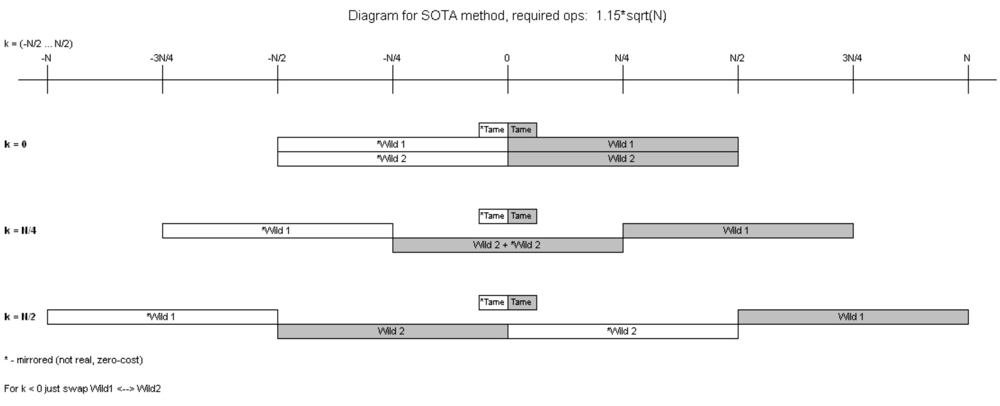

PART 1.

Discussion thread: https://bitcointalk.org/index.php?topic=5517607

This software demonstrates various ways to solve the ECDLP using Kangaroos.
The required number of operations is approximately K * sqrt(range), where K is a coefficient that depends on the method used.
This software demonstrates four methods:

1 - Classic. The simplest method. There are two groups of kangaroos: tame and wild. 
As soon as a collision between any tame and wild kangaroos happens, the ECDLP is solved.
In practice, K is approximately 2.1 for this method.

2 - 3-way. A more advanced method. There are three groups of kangaroos: tame, wild1, and wild2. 
As soon as a collision happens between any two types of kangaroos, the ECDLP is solved.
In practice, K is approximately 1.6 for this method.

3 - Mirror. This method uses two groups of kangaroos and the symmetry of the elliptic curve to improve K. 
Another trick is to reduce the range for wild kangaroos.
In practice, K is approximately 1.3 for this method.
The main issue with this method is that the kangaroos loop continuously.

4 - SOTA. This method uses three groups of kangaroos and the symmetry of the elliptic curve.
In practice, K is approximately 1.15 for this method. The main issue is the same as in the Mirror method.
I couldn’t find any papers about this method, so let's assume that I invented it :)
See "diagram.jpg" for details.

Important note: this software handles kangaroo looping in a very simple way. 
This method is bad for large ranges higher than 100 bits. 
Next part will demonstrate a good way to handle loops.

